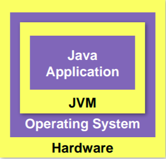

# Java 
1. Dynamic memory managment (Garbage Collector)
2. No Pointers
3. No operator overloading
4. No Multiple Inheritance

- Java Is both Compiled-One time-and Interpreted.
- JVM + Libraries = JRE + Compiler + Utilities = JDK

- **Java is Networked, Simplfy Network programming**

